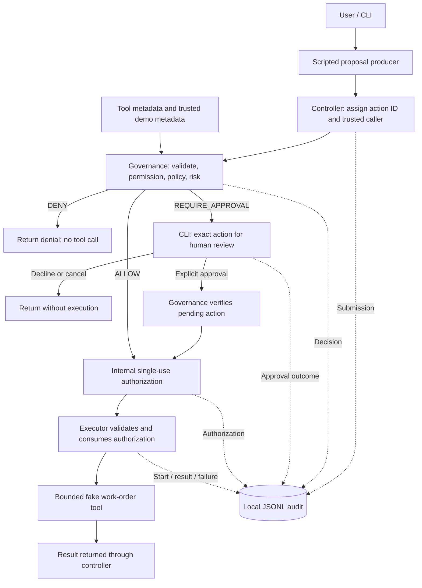

# Architecture

## Scope and trust model

The planned Python 3.12+ process hosts a CLI, a scripted proposal producer,
deterministic governance, an executor, bounded demo tools, and a JSONL audit sink.
These are logical responsibilities; this document does not require one package or class
per component. Milestone 2A implements only core data contracts and their tests,
under review. The control components and provider integration are not implemented.

Proposals are untrusted input. The application supplies caller context, policy,
resource metadata, approval input, and authorization. Arbitrary malicious code
inside this process is outside the threat model. This is an MVP/prototype, not
a production-ready system or security sandbox. Its controls apply through the
defined interfaces; a coding change that adds a bypass defeats that boundary.

## Components

| Component | Responsibility and boundary |
| --- | --- |
| Proposal producer | Emits tool names and arguments; initially scripted, later replaceable by a model adapter. Receives descriptions and results, never executable handlers or tool credentials. |
| CLI/controller | Assigns action IDs, attaches a configured caller, coordinates evaluation and execution, and collects human input. It cannot grant itself execution permission. |
| Contracts and tool registry | Describe tools, validate argument schemas, and resolve bounded targets. Agent-facing metadata is separate from the execution-side handler mapping. |
| Governance | Checks permission, evaluates deterministic policy and risk, records decisions, processes required approval, and issues internal authorization. Work-order rules are supplied by the demo layer. |
| Approval interface | Shows the exact validated action and its consequence; accepts explicit human approval or decline through the terminal. Proposal text is never approval evidence. |
| Executor | Resolves and consumes internal authorization, loads the authorized action, records execution start, and invokes the registered handler. It does not accept replacement arguments. |
| Demo tools and data | Implement the two bounded work-order operations over fake local fixtures. No paths, credentials, endpoints, or real industrial resources come from proposals. |
| Audit sink | Appends correlated lifecycle events to local JSONL. Required pre-execution writes gate progress toward dispatch. |

Only the execution side imports and invokes tool handlers. The controller calls
the executor with an authorization reference, not with a handler or raw action.
Governance reads trusted resource metadata without executing the proposed tool.

The audit arrows show event ownership, not optional logging: required records
must be written successfully before the handler can run.

## Minimal contracts

The table describes the intended control system. Milestone 2A implements the
record and enum subset described below; the remaining responsibilities are
deferred.

| Concept | Minimum content and ownership |
| --- | --- |
| Proposal | Untrusted tool name and arguments. Unknown fields, including approval or permission claims, do not confer authority. |
| Submission envelope | Host-generated action ID and trusted caller context, assigned before parsing or validation. Invalid input still has an ID. |
| `ActionRequest` | After governance: validated tool identifier, canonical arguments, resolved target identifier, action ID, and trusted caller. Stored as an immutable snapshot; the target is derived from validated arguments, not independently supplied. Construction alone does not establish this validation. |
| `Permission` | A configured allowlist linking the trusted caller to tool capabilities. No match means deny. |
| `Policy` | Deterministic application rules that inspect the validated request and trusted context; hard-deny rules take precedence over approval. |
| `Risk` | A deterministic classification of the action and trusted target context, used by policy and recorded with the decision. It is not fixed per tool and never grants permission. |
| Governance result | Action ID, a `Decision` outcome (`ALLOW` / `DENY` / `REQUIRE_APPROVAL`), risk when classification is possible, and a stable reason code plus readable explanation. This richer result is deferred to Milestone 2B; a decision is not an execution credential. |
| Execution authorization | Governance-owned record referring to the exact validated request, with usable/consumed state. Pending or denied requests provide no usable execution authorization. The executor receives only an internal opaque reference. |
| `AuditEvent` | Event type, timestamp, action ID, trusted caller when known, and relevant decision, approval, or execution details. |

Malformed or unresolved submissions receive a `DENY` decision with a validation
reason. They do not require a fabricated validated request or risk value. If the
tool and target can be safely resolved as a protected or critical mutation, it
remains HIGH risk and denied even when arguments or permissions also fail.

### Milestone 2A contract implementation

The flat `controlled_agent/` package contains `__init__.py` and `contracts.py`.
Contracts use frozen, slotted, keyword-only standard-library dataclasses and
string enums. Mapping payloads are recursively copied into read-only mapping
proxies; lists become tuples. This detaches each record from mutable input and
preserves an immutable snapshot of JSON-compatible data. It does not perform
domain normalization or semantic tool-argument validation. Caller identifiers,
tool names, targets, and descriptions must be plain strings; string subclasses
are rejected because they can retain mutable attributes or live references.

| Implemented contract | Contents and limits |
| --- | --- |
| `CallerContext` | Required `caller_id` string. No permission list or authentication behavior; the future application supplies trusted context. |
| `ActionRequest` | Required UUID `action_id`, `tool_name`, argument mapping, and `CallerContext`; optional target identifier for later trusted resolution. Construction checks structure, not whether the tool, arguments, caller, or target are allowed. |
| `Decision` | Exactly `ALLOW`, `DENY`, and `REQUIRE_APPROVAL`. It is the outcome enum, not a governance result or authority. |
| `Risk` | `LOW`, `MEDIUM`, and `HIGH`, with no numeric ordering or automatic authorization meaning. Classification is deferred. |
| `ToolDefinition` | Name, description, and immutable argument-schema metadata. No handler, fixed risk, schema evaluator, or registry behavior. |
| `Authorization` | UUID authorization identifier, complete immutable `ActionRequest`, and `AuthorizationState` (`USABLE` or `CONSUMED`). This is a data record only; constructing it does not grant execution rights. |
| `AuditEvent` | UUID action ID, `AuditEventType`, timezone-aware timestamp defaulting to UTC, optional caller, and immutable details. The nine event types below are represented; no logger or event-payload policy is implemented. |

Action IDs are supplied by trusted application code before parsing, so malformed
input can be correlated without constructing an `ActionRequest`. The contracts
check UUID representation but cannot prove its provenance; ID generation and
submission handling are deferred. Likewise, the optional target is intended to
be populated by a later trusted resolver, not to create independent authority
for a model-supplied target. Authorization must eventually bind the semantically
validated, resolved request, not merely any structurally valid record.

There is no authorization issuance, consumption, state-transition method, or
trusted registry in Milestone 2A. `USABLE` records created by callers are data,
not execution credentials. The future executor must resolve an internal
reference against governance-owned state. Audit events accept timezone-aware
timestamps from other zones as well as UTC; JSONL serialization and event-specific
payload requirements remain deferred.

Neither an `authorization_id` nor `AuthorizationState.USABLE` proves trusted
issuance. The future executor must not accept a supplied `Authorization` object
as authority; it must retrieve the record through its internal reference boundary.
The record is internal data, not agent-facing metadata. `USABLE` on a supplied
record is an unverified label. Its UUID is not automatically a registered
execution reference, and construction does not enforce identifier uniqueness.
Those guarantees belong to future trusted issuance state.

`AuditEvent.details` imposes JSON-like structure and immutability only. Sensitive
payload/result retention and redaction policy belongs to later event producers;
the contract neither selects retained fields nor detects secrets.

`ToolDefinition` has no handler, handler-reference, or credential field. Metadata
authors must nevertheless keep secrets and internal execution references out of
descriptions, schema text, defaults, and examples. Structural checks reject live
objects but cannot detect secrets embedded in otherwise valid text. No secret
scanner, reference resolver, or payload-storage policy is part of these contracts.

## End-to-end flow

1. The controller assigns an ID and trusted caller to every submission and
   writes a bounded, safe submission record before validation. An audit failure
   stops processing and is reported to the CLI with the action ID.
2. Governance resolves the tool and known target where possible and validates
   arguments. Invalid input cannot produce an executable request; valid input
   produces a canonical immutable request.
3. Governance checks the configured caller's permission. Unknown tools,
   unknown targets, invalid arguments, absent permissions, and unresolved rules
   require denial regardless of risk.
4. Domain-supplied deterministic rules classify risk using safely resolved
   action details and trusted metadata. Governance considers target, arguments,
   permissions, and policy together. A hard denial always wins; the same tool
   can receive different classifications and decisions. Record the decision.
5. `DENY` ends the attempt. `REQUIRE_APPROVAL` creates pending review state;
   it grants no execution authority. `ALLOW` can proceed to authorization.
6. For required approval, the CLI shows the canonical tool, exact work-order
   ID, current status, proposed status, and intended effect. Only an explicit
   affirmative response to that pending action counts. Record the result.
7. Governance issues authorization only after a permitted decision, any
   required approval, and required audit writes succeed. The authorized action
   is the same immutable snapshot used for evaluation and human review.
8. The executor validates the reference, consumes it once, and successfully
   records execution start before invoking the handler. A failed pre-execution
   write blocks dispatch and does not restore consumed authorization.
9. The executor records success or failure and returns the result through the
   controller. Handler errors do not restore authorization or trigger retries.

## Execution authorization and approval

Authorization binds the action ID, trusted caller, tool identifier, canonical
arguments, and resolved target. The executor loads those values from the
internal record; callers cannot swap in another work order or status. An
`approved=true` field, public `Decision` object, or raw `ActionRequest` is never
sufficient to invoke a tool.

Only governance may make an authorization usable. The executor may consume it,
but cannot create one. Missing, fabricated, pending, denied, or consumed
references fail before handler invocation. The executor must attempt an
`execution_blocked` audit event for each rejected call, using the originating
action ID when known. If there is no known originating action, the application
assigns a fresh host-generated action ID to the blocked attempt. Audit failure
must be reported through the CLI; the handler remains uninvoked.

Approval applies once to one exact pending action. Resolving approval closes that
pending review; governance may issue at most one execution authorization per
action ID. A consumed authorization cannot be reissued from the same decision
or approval. Any further execution attempt requires a fresh submission.

Decline, blank/default input, EOF, cancellation, or interruption never implies
approval. Editing the proposed action requires a new submission and governance
evaluation. There is no CLI override for a hard denial and no blanket approval mode.

Approval and authorization records exist only for the current process. Restart
invalidates them; the audit log is not used to recreate execution permission.
Actions run sequentially. There is no queue, parallel dispatcher, or automatic
retry. The internal reference representation remains an implementation detail;
cryptographic tokens or a separate authorization service are not required by
the current threat model.

## Domain boundary and demo conventions

The core understands actions, targets, permissions, decisions, and generic
policy results. It must not contain work-order IDs, status names, or industrial
conditions. The demo registers schemas, trusted fixture metadata, policy
functions, and handlers through explicit interfaces; no dynamic plugin system
or policy language is needed.

Confirmed demo setup and rules:

- One configured caller, `demo_operator`, has permission for both tools.
  Missing-permission tests use a restricted configuration, not a login system.
- `WO-1001` is editable; `WO-9001` is protected and critical.
  Only these fake resources are addressable. Protection metadata is trusted
  application data and cannot be changed by either tool or proposal arguments.
- Allowed reads are `LOW` risk → `ALLOW`; normal editable status updates with
  valid arguments and permission are `MEDIUM` risk → `REQUIRE_APPROVAL`;
  identifiable mutations of protected or critical targets are `HIGH` risk →
  `DENY`. These application risk labels are not an industrial safety assessment.
- The same update tool implements both mutation paths. Risk is context-sensitive
  and cannot grant permission or override a denial. A LOW-risk read without
  permission is still denied. Human approval can never override `DENY`.
- Approval and authorization stay in memory and expire on restart. Local JSONL
  audit logs persist; they cannot be used to restore execution permission.

Remaining sample conventions for review:

- Both work orders start `open`.
- The update schema accepts `work_order_id` and `new_status`; the read schema
  accepts only `work_order_id`. Status values are `open`, `in_progress`, and
  `closed`. No arbitrary field updates or user-supplied resource paths exist.
- Initially, work orders live in local in-memory fixtures and reset on restart.
  Writes change their status within a run; only the audit log is persistent.
- A valid same-status update to an editable fixture with permission also
  requires approval. No industrial transition workflow is modeled in this MVP.
- Policy configuration and protection metadata are fixed during a run. Human
  review and execution are sequential, without intervening sample-data updates.

| Request / condition | Risk if classified | Outcome / required behavior |
| --- | --- | --- |
| Read `WO-1001` or `WO-9001`, with valid arguments and permission | LOW | `ALLOW`; execute once |
| Update `WO-1001` to any valid status, with permission | MEDIUM | `REQUIRE_APPROVAL`; execute only after approval |
| Any identifiable mutation of `WO-9001`, including closure | HIGH | Hard `DENY`; no approval prompt or handler call |
| Known tool without permission | From resolvable context | `DENY`; risk cannot bypass permission |
| Invalid status, unknown target/tool, or malformed input | HIGH for an identifiable protected/critical mutation; otherwise may be unclassified | `DENY` with validation reason; no handler call |
| Declined or cancelled pending approval | Original classification | No authorization and no execution |
| Missing, changed, or reused authorization | Not a new policy evaluation | Block execution before handler invocation |
| Required pre-execution audit write fails | Any | Stop without invoking a handler |
| Handler throws after dispatch | Original classification | Record failure if possible; report any uncertain effect; no retry |

## Audit behavior

Use an append-only application write pattern to a local JSONL file. This is not
tamper resistance: a local user or malicious in-process code can alter the file.
Recommended runtime output directory: `var/`, ignored by Git. Audit records are
data and never instructions, approvals, or replayable authorization.

The minimum event vocabulary is `action_submitted`, `governance_decision`,
`approval_requested`, `approval_result`, `authorization_issued`,
`execution_started`, `execution_succeeded`, `execution_failed`, and
`execution_blocked`. A malformed action appears as a submission followed by a
denial with a validation reason. Approval results distinguish approved,
declined, and cancelled. A denial does not produce an execution-started event.

Events share the action ID. Include the tool and canonical target/arguments
when valid, risk and reason when available, and concise execution outcomes.
The approved action must be recoverable from correlated records. Avoid raw
unbounded input dumps; log safe error descriptions for malformed submissions.
Fake demo arguments can be recorded exactly. Do not log credentials or assume
future real operational data is safe to retain without a new review.

Required submission, decision, approval, authorization, and execution-start
records must be successfully appended and flushed before dispatch. A failure
stops execution, reports an audit error through the CLI, and does not result in
a success response. This does not promise survival of every OS or power failure.

If writing the result fails after a handler runs, the side effect cannot be
undone merely by failing the log write. Report the tool outcome if known and
the audit failure separately; otherwise report an uncertain outcome. Do not
retry automatically. A log ending at execution start is an incomplete attempt,
not proof of success or proof of no effect. Complete durable auditing cannot be
guaranteed when its storage itself is unavailable.

## Verification and deferred choices

Future tests must assert handler invocation counts and resulting sample state,
not merely decision labels. Cover all table rows, context-sensitive risk and
decisions for the same tool, approval binding, hard-deny precedence,
forged/reused references, attempted authorization reissuance, mutation after
approval, and audit failures at the relevant pre- and post-execution stages.

Milestone 2A uses standard-library `unittest` for contract checks. These checks
cover record structure and immutability, not the unimplemented control flow.
Run `python3.12 -B -m unittest discover -s tests -v` from the repository root.

CLI parsing, semantic argument validation, permission/policy evaluation, the
richer governance result, and trusted authorization-state management remain
deferred. UUID identifiers describe the record shape without implementing an
execution credential. Provider, model, SDK, and model-loop integration remain
deferred until the deterministic boundary works. A future adapter may propose
actions but may not auto-dispatch tools.
