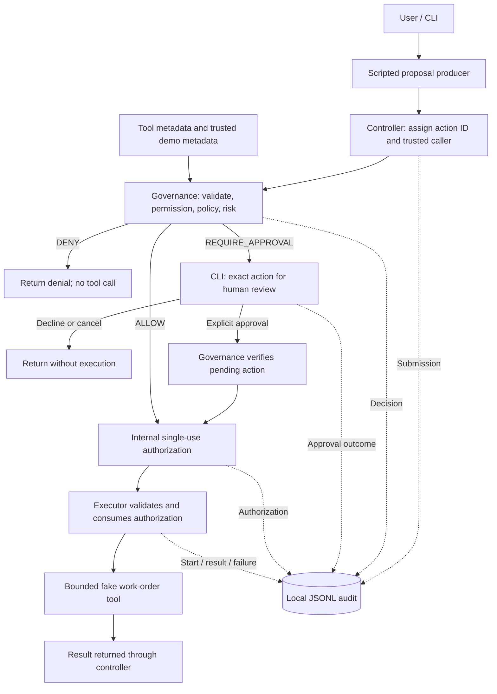

# Architecture

## Scope and trust model

The planned Python 3.12+ process hosts a CLI, a scripted proposal producer,
deterministic governance, an executor, bounded demo tools, and a JSONL audit sink.
These are logical responsibilities; this document does not require one package or class
per component. Milestones 2A, 2B, and 3A are approved and committed. Milestone 3B
adds optional synchronous human approval through trusted injected callbacks,
under review. Executor, tool handlers, concrete audit storage, CLI, and provider
integration remain deferred.

Proposals are untrusted input. The application supplies caller context, policy,
resource metadata, approval input, and authorization. Arbitrary malicious code
inside this process is outside the threat model. This is an MVP/prototype, not
a production-ready system or security sandbox. Its controls apply through the
defined interfaces; a coding change that adds a bypass defeats that boundary.

## Planned components and boundaries

| Component | Responsibility and boundary |
| --- | --- |
| Proposal producer | Emits tool names and arguments; initially scripted, later replaceable by a model adapter. Receives descriptions and results, never executable handlers or tool credentials. |
| CLI/controller | Assigns action IDs, attaches a configured caller, coordinates evaluation and execution, and collects human input. It cannot grant itself execution permission. |
| Contracts and tool registry | Describe tools, validate argument schemas, and resolve bounded targets. Agent-facing metadata is separate from the execution-side handler mapping. |
| Governance | Checks permission, evaluates deterministic policy and risk, records decisions, processes required approval, and issues internal authorization. Work-order rules are supplied by the demo layer. |
| Approval interface | Shows the exact validated action and its consequence; accepts explicit human approval or decline through the terminal. Proposal text is never approval evidence. |
| Executor | Resolves and consumes internal authorization, loads the authorized action, records execution start, and invokes the registered handler. It does not accept replacement arguments. |
| Demo tools and data | Implement the two bounded work-order operations over fake local fixtures. No paths, credentials, endpoints, or real industrial resources come from proposals. |
| Audit sink | Appends correlated lifecycle events to local JSONL. Required pre-execution writes gate progress toward dispatch. |

Only the execution side imports and invokes tool handlers. The controller calls
the executor with an authorization reference, not with a handler or raw action.
Governance reads trusted resource metadata without executing the proposed tool.

The audit arrows show event ownership, not optional logging: required records
must be written successfully before the handler can run.

## Minimal contracts

The table describes the intended control system. Milestone 2A implements the
base records and enums; Milestone 2B adds the governance result and evaluation.
Milestone 3A adds trusted issuance/consumption; 3B adds human approval using
injected I/O. Dispatch, concrete terminal I/O, and audit storage remain deferred.

| Concept | Minimum content and ownership |
| --- | --- |
| Proposal | Untrusted tool name and arguments. Unknown fields, including approval or permission claims, do not confer authority. |
| Submission envelope | Host-generated action ID and trusted caller context, assigned before parsing or validation. Invalid input still has an ID. |
| `ActionRequest` | After governance: validated tool identifier, canonical arguments, resolved target identifier, action ID, and trusted caller. Stored as an immutable snapshot; the target is derived from validated arguments, not independently supplied. Construction alone does not establish this validation. |
| `Permission` | A configured allowlist linking the trusted caller to tool capabilities. No match means deny. |
| `Policy` | Deterministic application rules that inspect the validated request and trusted context; hard-deny rules take precedence over approval. |
| `Risk` | A deterministic classification of the action and trusted target context, used by policy and recorded with the decision. It is not fixed per tool and never grants permission. |
| `GovernanceResult` | Action ID, a `Decision` outcome (`ALLOW` / `DENY` / `REQUIRE_APPROVAL`), risk when classification is possible, and a stable uppercase reason code plus readable explanation. Implemented in Milestone 2B; a decision is not an execution credential. |
| Execution authorization | Governance-owned record referring to the exact validated request, with usable/consumed state. Pending or denied requests provide no usable execution authorization. The executor receives only an internal opaque reference. |
| `AuditEvent` | Event type, timestamp, action ID, trusted caller when known, and relevant decision, approval, or execution details. |

Malformed or unresolved submissions receive a `DENY` decision with a validation
reason. They do not require a fabricated validated request or risk value. If the
tool and target can be safely resolved as a protected or critical mutation, it
remains HIGH risk and denied even when arguments or permissions also fail.

### Milestone 2A contract implementation

The flat `controlled_agent/` package contains `__init__.py` and `contracts.py`.
Contracts use frozen, slotted, keyword-only standard-library dataclasses and
string enums. Mapping payloads are recursively copied into read-only mapping
proxies; lists become tuples. This detaches each record from mutable input and
preserves an immutable snapshot of JSON-compatible data. It does not perform
domain normalization or semantic tool-argument validation. Caller identifiers,
tool names, targets, and descriptions must be plain strings; string subclasses
are rejected because they can retain mutable attributes or live references.

| Implemented contract | Contents and limits |
| --- | --- |
| `CallerContext` | Required `caller_id` string. No permission list or authentication behavior; the future application supplies trusted context. |
| `ActionRequest` | Required UUID `action_id`, `tool_name`, argument mapping, and `CallerContext`; optional target identifier for later trusted resolution. Construction checks structure, not whether the tool, arguments, caller, or target are allowed. |
| `Decision` | Exactly `ALLOW`, `DENY`, and `REQUIRE_APPROVAL`. It is the outcome enum, not a governance result or authority. |
| `Risk` | `LOW`, `MEDIUM`, and `HIGH`, with no numeric ordering or automatic authorization meaning. Milestone 2B supplies classification through domain policy functions. |
| `ToolDefinition` | Name, description, and immutable argument-schema metadata. No handler, fixed risk, schema evaluator, or registry behavior. |
| `Authorization` | UUID authorization identifier, complete immutable `ActionRequest`, and `AuthorizationState` (`USABLE` or `CONSUMED`). This is a data record only; constructing it does not grant execution rights. |
| `AuditEvent` | UUID action ID, `AuditEventType`, timezone-aware timestamp defaulting to UTC, optional caller, and immutable details. The nine event types below are represented; no logger or event-payload policy is implemented. |

Action IDs are supplied by trusted application code before parsing, so malformed
input can be correlated without constructing an `ActionRequest`. The contracts
check UUID representation but cannot prove its provenance; ID generation and
submission handling are deferred. Likewise, the optional target is intended to
be derived by trusted resolution, not to create independent authority for a
model-supplied target. Milestone 2B checks any supplied target against the target
derived from arguments. Authorization must eventually bind the semantically
validated, resolved request, not merely any structurally valid record.

There is no authorization issuance, consumption, state-transition method, or
trusted registry in Milestone 2A. `USABLE` records created by callers are data,
not execution credentials. The future executor must resolve an internal
reference against governance-owned state. Audit events accept timezone-aware
timestamps from other zones as well as UTC; JSONL serialization and event-specific
payload requirements remain deferred.

Neither an `authorization_id` nor `AuthorizationState.USABLE` proves trusted
issuance. The future executor must not accept a supplied `Authorization` object
as authority; it must retrieve the record through its internal reference boundary.
The record is internal data, not agent-facing metadata. `USABLE` on a supplied
record is an unverified label. Its UUID is not automatically a registered
execution reference, and construction does not enforce identifier uniqueness.
Those guarantees belong to the Milestone 3A service's trusted issuance state.

`AuditEvent.details` imposes JSON-like structure and immutability only. Sensitive
payload/result retention and redaction policy belongs to later event producers;
the contract neither selects retained fields nor detects secrets.

`ToolDefinition` has no handler, handler-reference, or credential field. Metadata
authors must nevertheless keep secrets and internal execution references out of
descriptions, schema text, defaults, and examples. Structural checks reject live
objects but cannot detect secrets embedded in otherwise valid text. No secret
scanner, reference resolver, or payload-storage policy is part of these contracts.

### Milestone 2B governance implementation

`governance.evaluate_action` is a domain-neutral evaluation function accepting a
host-assembled `ActionRequest` and trusted tool rules, permission sets, and resource
metadata. Caller identity and the action ID are trusted application inputs; this
API does not authenticate them or deserialize model output. Non-`ActionRequest`
input raises `TypeError` without an outcome or authority. Semantically malformed
records return `DENY`. Raw parsing, submission IDs, and audit integration remain
controller work for a later milestone.

Internal `ToolRules` combines public `ToolDefinition` data with three trusted pure
functions: argument validation, target resolution, and contextual policy
evaluation. It contains no tool handler and must not be exposed as agent metadata.
The descriptive schemas are not interpreted by a general JSON Schema engine;
small explicit demo validators enforce their documented required fields, string
types, status values, and rejection of extra arguments.

Evaluation looks up the tool and resolves a known target from arguments, then
evaluates policy using trusted resource metadata and a separate request snapshot
with that target. Policy must safely handle incomplete arguments. A policy DENY
returns immediately, so an identifiable protected mutation stays HIGH / DENY even
with invalid status, mismatched supplied target, or missing permission. Otherwise,
a target mismatch, invalid arguments, or missing permission denies the action in
that order. A favorable policy outcome also requires a known risk. Risk never
bypasses any check. The original request and demo metadata remain unchanged.

The supplied `ActionRequest.target` is never a fallback when argument resolution
fails. Neither that field nor argument claims such as `target`, `protected`,
`risk`, `approved`, or `decision` manufacture resource metadata. The HIGH-risk
protected denial requires both a safely resolved target and trusted metadata
identifying protection or criticality. A protected-looking ID without that
metadata fails closed without inventing a HIGH classification. Callback names or
code strings in arguments are inert extra fields, never dynamically resolved.

Policy returns only a proposed `GovernanceResult`; the core checks its action ID
and applies the remaining gates. Missing/invalid policy results fail closed.
Ordinary configuration/callback exceptions become `GOVERNANCE_ERROR` without
exposing exception text; cancellation interrupts evaluation and yields no rights.
Configuration and callbacks are trusted, fixed during evaluation, and must be
pure. This is not containment for arbitrary malicious Python callbacks.

Core reason codes are `UNKNOWN_TOOL`, `INVALID_TARGET`, `TARGET_MISMATCH`,
`INVALID_ARGUMENTS`, `PERMISSION_DENIED`, `POLICY_UNRESOLVED`, and
`GOVERNANCE_ERROR`. Demo policy codes are `READ_ALLOWED`,
`UPDATE_REQUIRES_APPROVAL`, `PROTECTED_TARGET`, and `TARGET_NOT_EDITABLE`.
Unknown tools or unresolved targets have no risk; resolvable validation/permission
denials retain the contextual risk when available. Codes, rather than explanation
text, are the machine-readable interface.

`demo.py` supplies two immutable fake resource records, permission sets for
`demo_operator`, descriptive tool schemas, and pure work-order policy functions.
Missing protection/editability metadata cannot permit an update; either a true
protected flag or a true critical flag independently hard-denies it. `DENY` has
no approval override API. `ALLOW` and `REQUIRE_APPROVAL` are evaluation data only;
no pending approval, authorization, tool invocation, or audit write occurs.

### Milestone 3A trusted authorization service

`authorization.AuthorizationService` is a host-only, domain-neutral service with
one private registry per application run. Construction snapshots the tool mapping,
permission sets, and nested resource metadata; trusted callback closures must
remain fixed and pure. A required synchronous `audit_write(AuditEvent)` callable
must return `None` only after the required write/flush succeeds, otherwise raise.
There is no default writer and no concrete sink; test recorders are not production
auditing. Callback purity and audit durability remain host responsibilities.

`issue(request)` accepts only a host-assembled `ActionRequest`, never a result,
authorization record, approval flag, or per-call configuration. It returns a tuple
of reportable `GovernanceResult` and a separate host-only reference or `None`.
The tuple and reference must never reach the proposal producer. Trust comes from
internal evaluation and private registry membership, not dataclass construction,
UUID representation, or a caller-supplied result.

The public `evaluate_action()` API is unchanged. Its internal evaluation path now
retains the exact resolved snapshot only after all semantic validation and
permission gates pass. The validator sees that snapshot's arguments. The service
calls this path itself and stores that same action object, without a second
evaluation or target resolution during issuance/consumption. DENY has no retained
validated action, but internal evaluation separately returns a known resolved
target for audit context when resolution succeeded. That identifier does not
assert argument validity or permission. Without 3B approval configuration,
REQUIRE_APPROVAL returns no reference and creates no pending review or approval evidence.

Issuance ordering:

1. Reserve the action ID before calling any audit or policy code. All admitted IDs
   remain reserved until process exit, even for denial, failure, or interruption.
2. Write `action_submitted` with a bounded registered tool selection explicitly
   labeled as a submission claim, without an argument dump; evaluate; write
   `governance_decision`. A duplicate ID is audited as a duplicate denial and
   raises `DuplicateActionError`, without touching previously issued authority.
3. ALLOW can continue directly; 3B additionally permits explicitly approved
   REQUIRE_APPROVAL actions through the gates below. Construct internal record data; write
   `authorization_issued` with retained tool/target identifiers, caller, action ID,
   and an auditable UUID. Arguments stay in the exact private action record;
   validation alone does not make them safe to log. The UUID is not an execution reference.
4. Publish a fresh identity-bound opaque reference in the private registry. If
   publication or return preparation raises, including interruption, remove any
   partially inserted entry and retain the reserved ID. A successful issuance
   audit alone never proves live authority and cannot be replayed to recover it.

`consume(reference)` is reserved for the execution side. It accepts only an exact
registered reference object from this service; supplied records, UUIDs, copies,
unknown references, and cross-registry references fail. It marks the entry
consumed before updating its descriptive record or returning the stored action.
Even an interruption during that update leaves the entry consumed. Consumption
accepts no replacement arguments or action and performs no revalidation.

Rejected consumption writes `execution_blocked`, using the originating action ID
for a known consumed reference or a fresh host ID for an unknown attempt. It never
serializes the supplied reference. Audit failure raises without returning an
action. Successful consumption emits no execution-start event because no executor
exists yet. The later executor must consume, successfully write/flush
`execution_started`, then invoke its handler; failure never restores the reference.

Operations are sequential and non-reentrant, not thread-safe. A nested call sets
an outer-failure flag and raises before callbacks or registry changes. Even if a
callback catches that rejection, the outer operation aborts at the next gate.
Nested rejections are not recursively audited. In-flight IDs remain reserved;
IDs in rejected nested calls are not admitted. Ordinary audit failures raise
`AuditWriteError`; interruptions propagate after cleanup. No automatic retry,
registry reset, persistence, or rights recovery exists. The host must not create
multiple live issuance authorities for the same run. Terminal entries accumulate
in memory for the lifetime of this bounded prototype.

This service has no handlers, concrete terminal I/O, CLI, model integration, or concrete
audit storage. Runtime reflection or malicious trusted callbacks can bypass Python
privacy; those remain outside the application's interface-level threat model.

#### Milestone 3A audit retention policy

Action IDs, timestamps, trusted caller context, decisions, risk, and stable reason
codes remain correlated event metadata. The host must configure public,
non-sensitive caller/tool/resource identifiers and reason codes. This is a trust
requirement, not automatic secret detection.

- `action_submitted.submitted_tool_name` is the untrusted selection of a registered
  tool name. Unknown tool strings are omitted (`None`), even if syntactically valid.
  No submitted target claim or arguments are retained.
- `governance_decision.tool_name` identifies the registered tool when known.
  `resolved_target` comes from the same evaluation's resolver and known resource
  metadata, never from the request's target claim. It can be present on DENY,
  including protected mutations and invalid arguments. `action_validated` is true
  only when all validation and permission gates passed; REQUIRE_APPROVAL can be
  true without granting any authority. Duplicate submissions are not evaluated,
  so their target is absent and `action_validated` is false.
- Retained tool/target identifiers must be 1–128 ASCII letters, digits, underscores,
  periods, colons, or hyphens. Other identifiers are omitted (`None`), not truncated
  into misleading identities. Omission changes only logging, never governance or
  the exact action in the registry.
- No event produced by this service retains arguments, arbitrary proposal fields,
  resource metadata, policy explanations, or opaque references. Issuance retains
  only the auditable UUID and bounded tool/target identifiers in its details.

These records identify attempts and outcomes, not the complete proposed payload.
For example, they do not distinguish proposed status values on the same target
except by action ID. Exact arguments stay in the private immutable action record
for issued actions. Any later argument/result retention needs an explicit safe
field policy; audit data can never recreate execution authority.

### Milestone 3B synchronous human approval

The host may supply both `approval_formatter` and `human_approval` when constructing
the service. Supplying only one is an error. `HumanApprovalAdapter` holds trusted
`display(ApprovalReview)` and `read_response()` callbacks; no default input source
or concrete terminal adapter is implemented. Callbacks must be synchronous.
The service controls their ordering and checks reentrancy after each callback.
No review dependencies, responses, decisions, or replacement actions are accepted
as per-request issuance arguments.

After an internally evaluated REQUIRE_APPROVAL decision is audited, the service
creates one private pending entry referencing the exact validated action and
governance result. DENY cannot create pending state or invoke review callbacks.
There is no public approval endpoint, exposed pending token, resume operation,
or queue. The existing non-reentrant operation spans the entire exchange.

1. Write `approval_requested` before any formatter/display/input callback. It
   records that review was requested, not proof of successful presentation.
2. Call the trusted formatter with the exact retained action and the immutable
   resource snapshot already used by governance. There is no second resolution
   or governance evaluation. The formatter returns `ApprovalChange` data: current
   state, proposed state, and intended effect. The service separately constructs
   an immutable `ApprovalReview` containing the original action identity, so the
   formatter cannot replace the action used for issuance.
3. Display the review, requiring a `None` return after successful presentation,
   then read one fresh human response. Action ID, trusted caller, canonical tool,
   target, and exact change must be presented. The demo formatter derives status
   fields from canonical arguments and trusted metadata and uses a fixed effect
   template; it does not accept proposal-authored descriptions as instructions.
4. Irreversibly close the pending entry before writing `approval_result`. Only a
   plain string whose surrounding-whitespace-trimmed value is exactly `approve`
   is affirmative. `decline` refuses. Empty/None input cancels; any other object
   or text, including booleans, dictionaries, string subclasses, and uppercase
   `APPROVE`, cancels. No automatic reprompt occurs.
5. Only an affirmative response with successful result auditing may reach the
   existing authorization-issued audit and registry publication sequence. The
   original governance result remains REQUIRE_APPROVAL in the returned tuple;
   the separate reference represents issuance. All exact-action and one-use
   registry guarantees remain unchanged.

Approval result details use only fixed outcomes/reasons: `approved/HUMAN_APPROVED`,
`declined/HUMAN_DECLINED`, `cancelled/NO_RESPONSE`, `cancelled/INVALID_RESPONSE`,
`cancelled/END_OF_INPUT`, `cancelled/INTERRUPTED`, or `error/REVIEW_FAILED`.
They retain the same bounded public tool/target context and correlation envelope;
raw responses, review text, current/proposed state, arguments, exceptions, pending
entries, and authorization references never enter these audit payloads.

EOF returns without authority. Ordinary review failures attempt a sanitized error
result and raise `ApprovalError`; interruptions attempt a cancelled result and
propagate. Pending state closes before these writes and is cleared on every exit.
A failed required audit is never retried recursively. If cancellation auditing
also fails during an interruption, the original interruption propagates with the
audit failure chained. Reentrancy poisons the outer operation; after detection no
further review callbacks or outcome-audit attempts run. Consequently failures may
leave an incomplete audit trail, never usable new authority. Host exceptions can
retain diagnostic causes and must not be exposed as raw agent-facing tracebacks.

The original action ID remains reserved after every outcome. No pending state or
approval can be replayed, resumed, imported, or reused after failure. Publication
failure, including partial insertion after a successful issuance audit, uses the
existing cleanup boundary and cannot reopen approval or reissue the same ID.

Display/input and formatter callbacks are trusted application code, not a security
sandbox. Formatters may describe only the canonical action; display callbacks must
faithfully present it, and readers must collect fresh human input rather than
proposal text, cached responses, or defaults. The service does not authenticate
humans, verify screens, or sandbox malicious callbacks. Current-state display is
the fixed resource snapshot captured at service construction: live freshness,
concurrent changes, and TOCTOU protection are explicitly deferred. No handler or
resource mutation occurs during this workflow.

## Planned end-to-end flow

1. The controller assigns an ID and trusted caller to every submission and
   writes a bounded, safe submission record before validation. An audit failure
   stops processing and is reported to the CLI with the action ID.
2. Governance resolves the tool and known target where possible and validates
   arguments. Invalid input cannot produce an executable request; valid input
   produces a canonical immutable request.
3. Governance checks the configured caller's permission. Unknown tools,
   unknown targets, invalid arguments, absent permissions, and unresolved rules
   require denial regardless of risk.
4. Domain-supplied deterministic rules classify risk using safely resolved
   action details and trusted metadata. Governance considers target, arguments,
   permissions, and policy together. A hard denial always wins; the same tool
   can receive different classifications and decisions. Record the decision.
5. `DENY` ends the attempt. `REQUIRE_APPROVAL` creates pending review state;
   it grants no execution authority. `ALLOW` can proceed to authorization.
6. For required approval, the CLI shows the canonical tool, exact work-order
   ID, current status, proposed status, and intended effect. Only an explicit
   affirmative response to that pending action counts. Record the result.
7. Governance issues authorization only after a permitted decision, any
   required approval, and required audit writes succeed. The authorized action
   is the same immutable snapshot used for evaluation and human review.
8. The executor validates the reference, consumes it once, and successfully
   records execution start before invoking the handler. A failed pre-execution
   write blocks dispatch and does not restore consumed authorization.
9. The executor records success or failure and returns the result through the
   controller. Handler errors do not restore authorization or trigger retries.

## Execution authorization and approval

Authorization binds the action ID, trusted caller, tool identifier, canonical
arguments, and resolved target. The executor loads those values from the
internal record; callers cannot swap in another work order or status. An
`approved=true` field, public `Decision` object, or raw `ActionRequest` is never
sufficient to invoke a tool.

Only governance may make an authorization usable. The executor may consume it,
but cannot create one. Missing, fabricated, pending, denied, or consumed
references fail before handler invocation. The executor must attempt an
`execution_blocked` audit event for each rejected call, using the originating
action ID when known. If there is no known originating action, the application
assigns a fresh host-generated action ID to the blocked attempt. Audit failure
must be reported through the CLI; the handler remains uninvoked.

Approval applies once to one exact pending action. Resolving approval closes that
pending review; governance may issue at most one execution authorization per
action ID. A consumed authorization cannot be reissued from the same decision
or approval. Any further execution attempt requires a fresh submission.

Decline, blank/default input, EOF, cancellation, or interruption never implies
approval. Editing the proposed action requires a new submission and governance
evaluation. There is no CLI override for a hard denial and no blanket approval mode.

Approval and authorization records exist only for the current process. Restart
invalidates them; the audit log is not used to recreate execution permission.
Actions run sequentially. There is no queue, parallel dispatcher, or automatic
retry. The internal reference representation remains an implementation detail;
cryptographic tokens or a separate authorization service are not required by
the current threat model.

## Domain boundary and demo conventions

The core understands actions, targets, permissions, decisions, and generic
policy results. It must not contain work-order IDs, status names, or industrial
conditions. The demo registers schemas, trusted fixture metadata, policy
functions, and handlers through explicit interfaces; no dynamic plugin system
or policy language is needed.

Confirmed demo setup and rules:

- One configured caller, `demo_operator`, has permission for both tools.
  Missing-permission tests use a restricted configuration, not a login system.
- `WO-1001` is editable; `WO-9001` is protected and critical.
  Only these fake resources are addressable. Protection metadata is trusted
  application data and cannot be changed by either tool or proposal arguments.
- Allowed reads are `LOW` risk → `ALLOW`; normal editable status updates with
  valid arguments and permission are `MEDIUM` risk → `REQUIRE_APPROVAL`;
  identifiable mutations of protected or critical targets are `HIGH` risk →
  `DENY`. These application risk labels are not an industrial safety assessment.
- The same update tool implements both mutation paths. Risk is context-sensitive
  and cannot grant permission or override a denial. A LOW-risk read without
  permission is still denied. Human approval can never override `DENY`.
- Approval and authorization stay in memory and expire on restart. Local JSONL
  audit logs persist; they cannot be used to restore execution permission.

Sample conventions (validation and metadata adopted in Milestone 2B):

- Both work orders start `open`.
- The update schema accepts `work_order_id` and `new_status`; the read schema
  accepts only `work_order_id`. Status values are `open`, `in_progress`, and
  `closed`. No arbitrary field updates or user-supplied resource paths exist.
- Milestone 2B work orders are immutable in-memory metadata. Future handlers
  will change fixture status within a run; only the future audit log persists.
- A valid same-status update to an editable fixture with permission also
  requires approval. No industrial transition workflow is modeled in this MVP.
- Policy configuration and protection metadata are fixed during a run. Human
  review and execution are sequential, without intervening sample-data updates.

| Request / condition | Risk if classified | Outcome / required behavior |
| --- | --- | --- |
| Read `WO-1001` or `WO-9001`, with valid arguments and permission | LOW | `ALLOW`; execute once |
| Update `WO-1001` to any valid status, with permission | MEDIUM | `REQUIRE_APPROVAL`; execute only after approval |
| Any identifiable mutation of `WO-9001`, including closure | HIGH | Hard `DENY`; no approval prompt or handler call |
| Known tool without permission | From resolvable context | `DENY`; risk cannot bypass permission |
| Invalid status, unknown target/tool, or malformed input | HIGH for an identifiable protected/critical mutation; otherwise may be unclassified | `DENY` with validation reason; no handler call |
| Declined or cancelled pending approval | Original classification | No authorization and no execution |
| Missing, changed, or reused authorization | Not a new policy evaluation | Block execution before handler invocation |
| Required pre-execution audit write fails | Any | Stop without invoking a handler |
| Handler throws after dispatch | Original classification | Record failure if possible; report any uncertain effect; no retry |

## Audit behavior

Use an append-only application write pattern to a local JSONL file. This is not
tamper resistance: a local user or malicious in-process code can alter the file.
Recommended runtime output directory: `var/`, ignored by Git. Audit records are
data and never instructions, approvals, or replayable authorization.

The minimum event vocabulary is `action_submitted`, `governance_decision`,
`approval_requested`, `approval_result`, `authorization_issued`,
`execution_started`, `execution_succeeded`, `execution_failed`, and
`execution_blocked`. A malformed action appears as a submission followed by a
denial with a validation reason. Approval results distinguish approved,
declined, and cancelled. A denial does not produce an execution-started event.

Events share the action ID. Include bounded known tool and resolved target context,
risk and reason when available, and concise execution outcomes when implemented.
Milestones 3A and 3B follow the identifier-only retention policy above; they do not
log arguments or claim that a full action can be reconstructed from logs. Human
approval displays and binds the exact action held in trusted state. Retaining
any argument or result fields in later audit events requires an explicit safe
field policy. Avoid raw unbounded input dumps and credentials; validation alone
does not establish that operational data is safe to retain.

Required submission, decision, approval, authorization, and execution-start
records must be successfully appended and flushed before dispatch. A failure
stops execution, reports an audit error through the CLI, and does not result in
a success response. This does not promise survival of every OS or power failure.

If writing the result fails after a handler runs, the side effect cannot be
undone merely by failing the log write. Report the tool outcome if known and
the audit failure separately; otherwise report an uncertain outcome. Do not
retry automatically. A log ending at execution start is an incomplete attempt,
not proof of success or proof of no effect. Complete durable auditing cannot be
guaranteed when its storage itself is unavailable.

## Verification and deferred choices

Future tests must assert handler invocation counts and resulting sample state,
not merely decision labels. Cover all table rows, context-sensitive risk and
decisions for the same tool, approval binding, hard-deny precedence,
forged/reused references, attempted authorization reissuance, mutation after
approval, and audit failures at the relevant pre- and post-execution stages.

Milestones 2A, 2B, 3A, and 3B use standard-library `unittest` for contract, governance,
and authorization checks. Tests cover structural immutability, correlated outcomes, all demo paths,
denial precedence, malformed arguments/targets, missing permission, spoofed
claims, contextual risk, deterministic results, callback failures, and the absence
of handler dispatch or issuance in pure governance. A document-domain policy exercises the generic
core independently of work-order rules. The full execution boundary is deferred.
Run `python3.12 -B -m unittest discover -s tests -v` from the repository root.

Authorization tests additionally cover internal evaluation provenance, exact
action retention, ALLOW-only issuance, immutable configuration, all mandatory
issuance audit gates, interruption, partial-publication cleanup, reentrancy,
duplicate IDs, forged/cross-registry references, replay, and consumed-state
retention on failure. Regression tests cover non-issued audit context, safe
identifier bounds and omitted payloads, decision-audit failures on both non-issued
paths, duplicate audit failures preserving earlier authority, callback interruptions,
and reentrancy after partial publication. Test writers do not establish durable audit guarantees.

Approval tests additionally prove exact action/result binding, canonical display
against a fixed resource snapshot, DENY bypassing review, strict human response
handling, closure before result auditing, audit failures, callback interruptions,
reentrancy, partial-publication cleanup, immutable review data, and rejection of
review/audit data as authority. The 3A tests run unchanged without approval configured.

CLI/raw proposal parsing, concrete human I/O, executor, tool handlers, and concrete
audit storage remain deferred. UUID identifiers remain descriptive record data;
only private registry membership supplies live authority. Provider, model, SDK, and model-loop integration remain
deferred until the deterministic boundary works. A future adapter may propose
actions but may not auto-dispatch tools.
